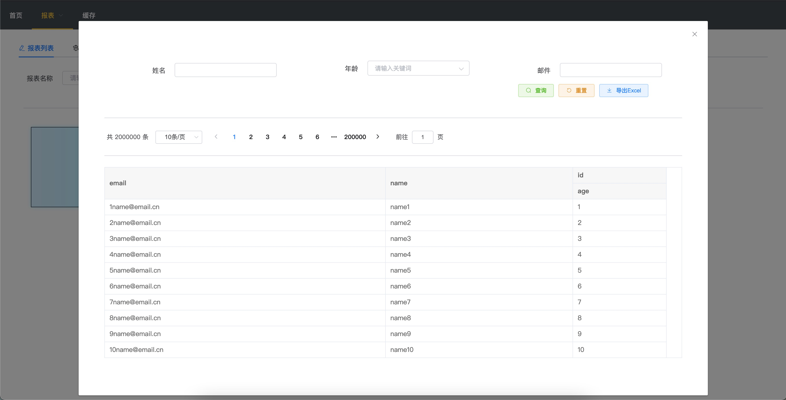

### y3tu-tool
Java工具类,把平时工作学习中用的技术进行汇总，用于学习使用。

* y3tu-tool-core:基础java工具类包
* y3tu-tool-cache:缓存工具，包含普通缓存和基于redis的多级缓存。
* y3tu-tool-web:web相关工具类包
* y3tu-tool-lowcode:低代码服务，提供报表、字典等服务和页面，后续会集成代码生成、可视化表单定义、可视化H5页面等功能

### lowCode使用
#### 1.maven依赖
```
<dependency>
  <groupId>com.y3tu</groupId>
  <artifactId>y3tu-tool-lowcode</artifactId>
  <version>2.2.3</version>
</dependency>
```
#### 2.配置
* y3tu.tool.lowcode.ui.urlPattern = /tool/*  
定义访问lowcode的路径，默认为/lowcode-ui/*
* y3tu.tool.lowcode.ui.username = admin   
定义登录用户名，默认admin
* y3tu.tool.lowcode.ui.password = admin   
定义登录密码，默认admin

#### 功能
-   [x] 多级缓存
-   [x] 字典配置
-   [x] 数据源配置
-   [x] 基础报表
-   [x] Jasper报表
-   [ ] 代码生成
-   [ ] 可视化定制页面
-   [ ] 可视化表单定义


- - -


### Thanks
代码参考以下优秀的开源项目：
- [hutool](https://gitee.com/loolly/hutool)
- [layering-cache](https://github.com/xiaolyuh/layering-cache) 


